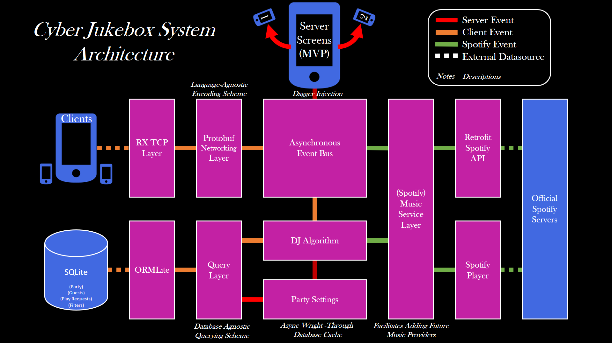

# Cyber Jukebox 
A democratic DJ app for Android created for the ECE-1896 (Senior Design) at University of Pittsburgh.
Cyber Jukebox allows a group of friends to all contribute to a music playlist democratically. Request tracks provided by Spotify from the virtual DJ, and vote on suggestions made by your friends. The highest number of votes wins! In order to leverage Spotify's services, the host needs a Spotify Premium account. Because we can't afford server hosting, parties must be held over LAN.
## Architecture
This project was designed as a first exposure to Android. Design goals included supporting modern Android programming practices such as functional reactive programming, and enabling high-throughput networking on a resource-limited device. A rough outline of the system architecture can be seen below.

## Credits
#### Engineering:
Fry, Trevor
Gannon, Zachary
Knight, Jordan
Povirk, Jonathan
#### Advising:
Dr. Alex Jones
